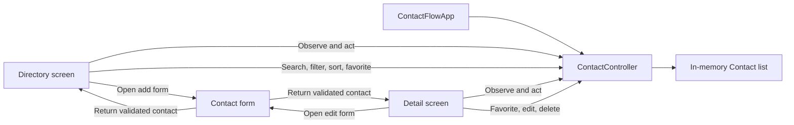

# ContactFlow

[](https://github.com/muhammadzain-byte/ContactFlow/actions/workflows/flutter.yml)


A responsive Flutter contact directory with search, favorites, session-based editing, and polished Hero transitions.

ContactFlow is a cohesive Flutter contact-management portfolio application. It uses a dependency-light architecture, responsive Material 3 layouts, and accessible controls across mobile, web, and desktop form factors.

## Highlights

- Search by name, role, company, phone number, email, or location.
- Filter favorites and sort contacts from A–Z or Z–A.
- Add, edit, favorite, and delete contacts during the current session.
- Open a detailed profile through a smooth, stable-ID Hero transition.
- Copy phone numbers and email addresses with built-in clipboard actions.
- Switch between polished light and dark Material 3 themes.
- Adapt from a one-column mobile list to a multi-column desktop grid.
- Use initials-based gradient avatars with no remote image dependency.
- Navigate with descriptive labels, tooltips, semantic state, and large touch targets.
- Validate state behavior and core user journeys with unit and widget tests.

## Demo scope

ContactFlow is an offline demonstration app. Contacts are seeded in memory, and changes reset when the app restarts. It does not read the device address book, place calls, send messages, upload data, run analytics, or connect to a backend.

All included contact details are fictional examples using `example.com` addresses and reserved `555-01xx` phone numbers.

## Architecture



The app uses Flutter's built-in `ChangeNotifier` for a small, explicit state layer:

- **Model** — immutable `Contact` records and search helpers.
- **Data** — fictional seed contacts for a useful first launch.
- **Controller** — search, filtering, sorting, favorites, and session CRUD.
- **Presentation** — responsive screens and reusable Material widgets.

No third-party state-management, database, networking, or device-contact package is required.

## Project structure

```text
lib/
|-- main.dart
|-- app.dart
|-- controllers/
|   `-- contact_controller.dart
|-- data/
|   `-- seed_contacts.dart
|-- models/
|   `-- contact.dart
|-- screens/
|   |-- contact_directory_screen.dart
|   |-- contact_detail_screen.dart
|   `-- contact_form_screen.dart
|-- theme/
|   `-- app_theme.dart
`-- widgets/
    |-- contact_avatar.dart
    |-- contact_card.dart
    `-- contact_empty_state.dart
```

## Getting started

### Prerequisites

- Flutter SDK with Dart 3.7 or newer
- Git
- A configured browser, desktop target, emulator, simulator, or physical device
- JDK 17 when building the included Android project

Confirm the local toolchain:

```bash
flutter doctor
```

### Install and run

```bash
git clone https://github.com/muhammadzain-byte/ContactFlow.git
cd ContactFlow
flutter pub get
flutter run
```

Choose a specific target when needed:

```bash
flutter run -d chrome
flutter run -d windows
```

Use `flutter devices` to list the targets available on your machine.

## Quality checks

Run the same checks used by the repository workflow:

```bash
dart format --output=none --set-exit-if-changed lib test
flutter analyze
flutter test
flutter build web --release
```

The test suite covers controller behavior, sorting, normalized search, favorites, session CRUD, directory rendering, form validation, detail navigation, and a narrow-screen large-text layout.

## Supported platform scaffolds

The repository includes Flutter runners for:

- Android
- iOS
- Web
- Windows
- macOS
- Linux

Platform folders are configured with the ContactFlow name and application identifier. Actual release builds still require the relevant operating system, signing configuration, and store credentials.

## Data and privacy

- Contact data stays in process memory.
- No network requests or analytics are performed.
- No device-contact or other runtime-sensitive permissions are requested by the release app. Flutter's debug/profile Android tooling may request development-only network access.
- Copy actions only write the selected value to the system clipboard.
- Closing the app discards additions and edits.

## Roadmap

- Optional local persistence
- Import and export
- Device-contact integration behind explicit permission prompts
- Real call and email actions
- Contact groups and tags
- Localization and additional accessibility testing

## Contributing

See [CONTRIBUTING.md](CONTRIBUTING.md) for the development workflow and pull-request checklist.

## License

Copyright © 2026 Muhammad Zain Ul Abdin. All rights reserved. No license is granted to copy, modify, or redistribute this project.
